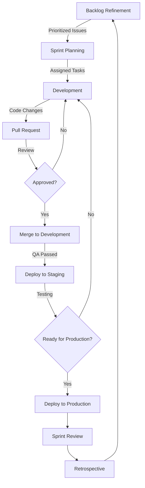
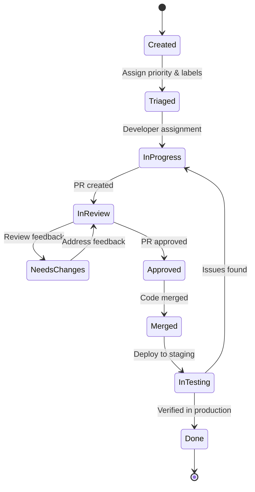
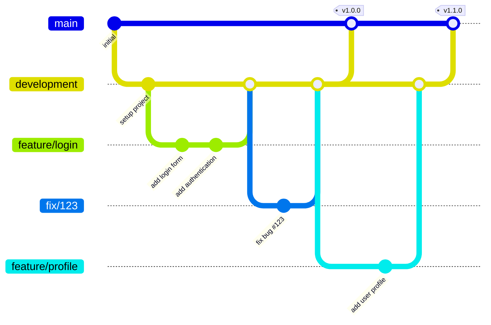
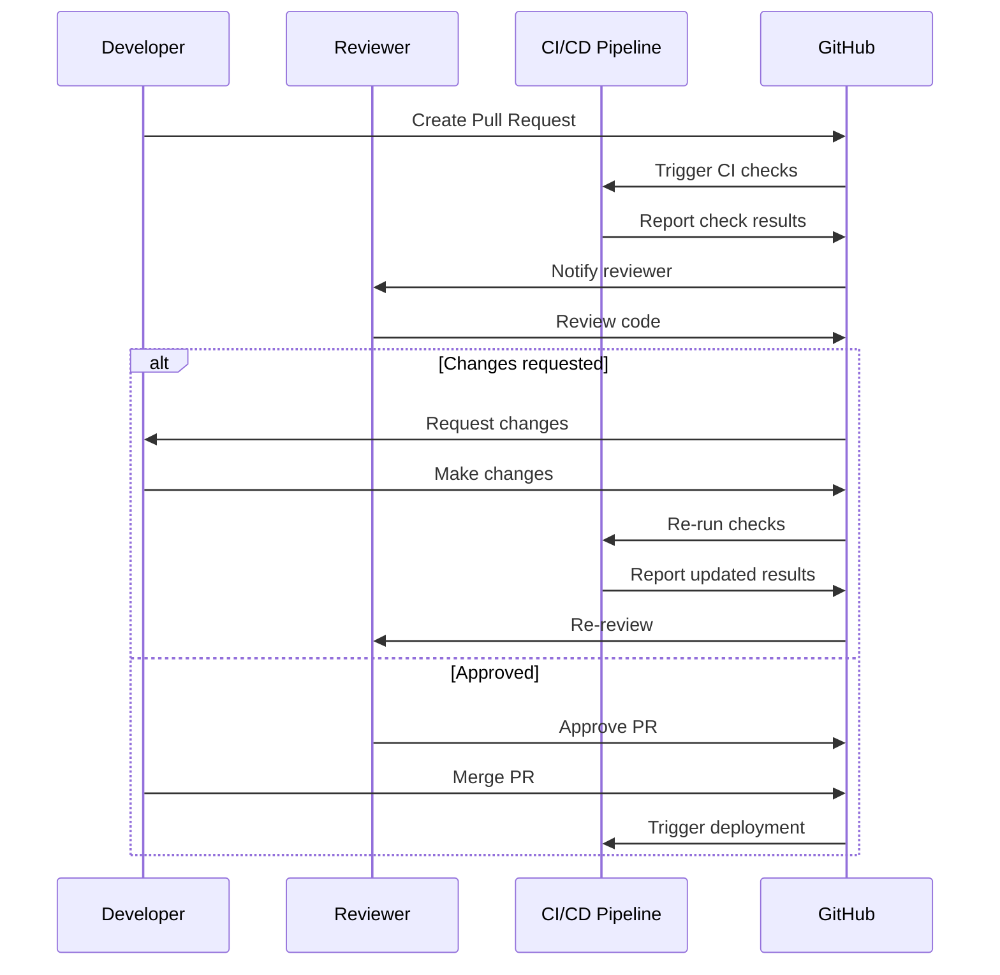
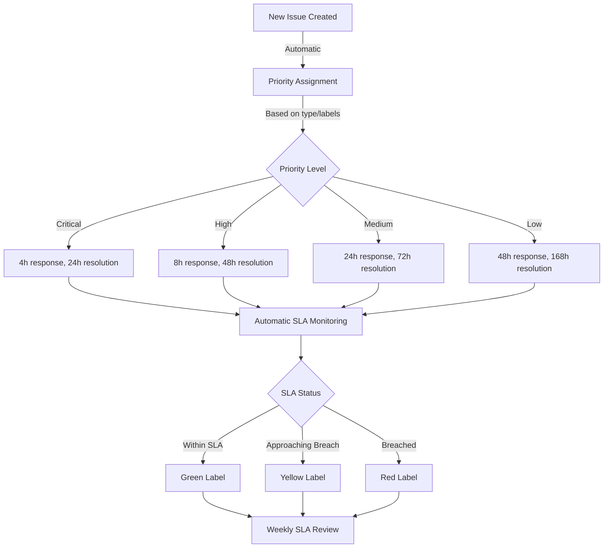
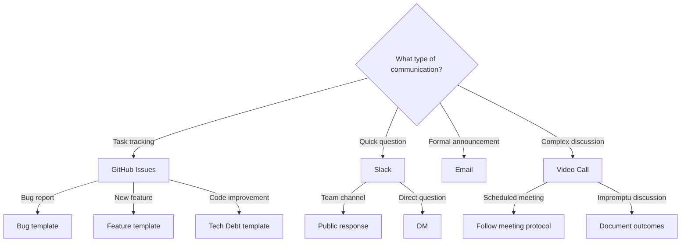
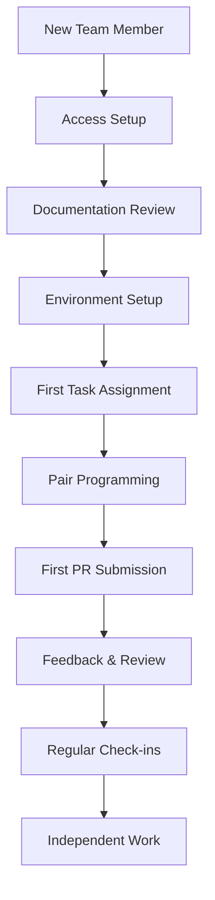

# Team Workflow Diagram

This document provides visual representations of our team's workflows to complement the [Team Collaboration Protocols](team-collaboration.md).

## Sprint Workflow

## Issue Lifecycle

## Git Branching Strategy

## Code Review Process

## SLA Monitoring Flow

## Communication Channels Decision Tree

## Onboarding Process

